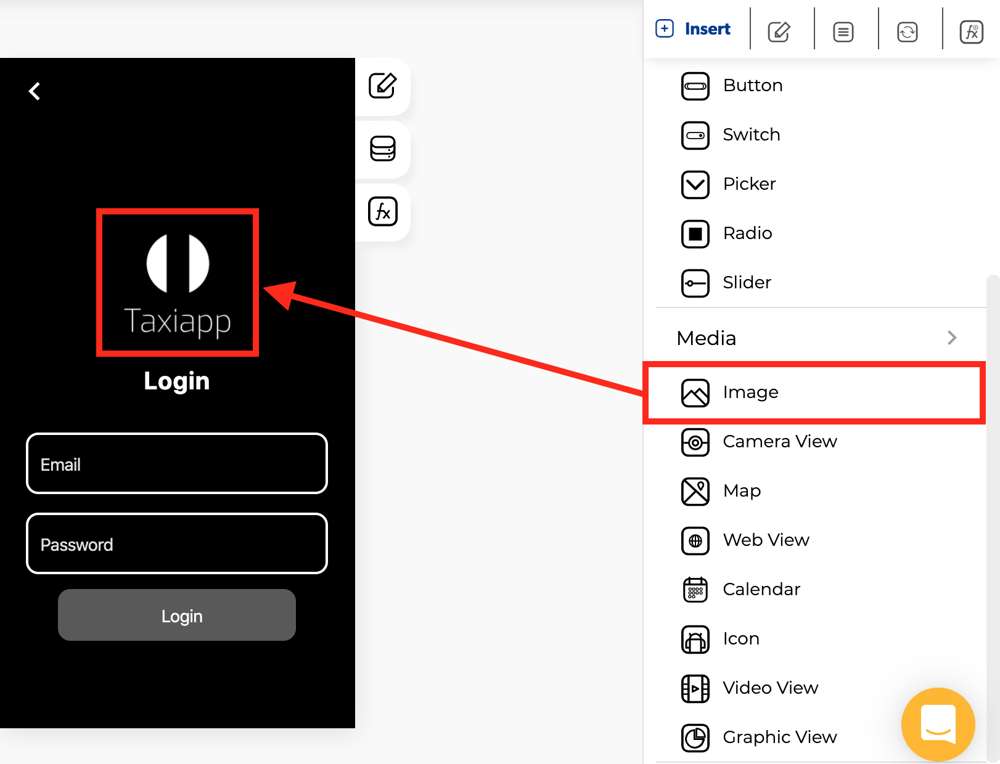

# Image

### 🎨 Styles 

* **Opacity**
  * **Opacity**: setting that allows you to adjust the transparency of an image 
* **Appearance**
  * **Background image**: this property set one background image for image element.
  * **Resize mode:**
    * **Cover:** scale the image uniformly \(maintain the image's aspect ratio\) so that both dimensions \(width and height\) of the image will be equal to or larger than the corresponding dimension of the view 
    * **Contain:** scale the image uniformly \(maintain the image's aspect ratio\) so that both dimensions \(width and height\) of the image will be equal to or less than the corresponding dimension of the view 
    * **Stretch:** scale width and height independently, This may change the aspect ratio of the source.
    * **Repeat:** repeat the image to cover the frame of the view. The image will keep its size and aspect ratio, unless it is larger than the view, in which case it will be scaled down uniformly so that it is contained in the view.
    * **Center:** center the image in the view along both dimensions. If the image is larger than the view, scale it down uniformly so that it is contained in the view. 
* **Dimensions**
  * **Width:** set how wide the image element is using.
  * **Height:** set how tall the image element is using. 
* **Margins**
  * **Padding:** you can specify how much space you want between the border and contents of the image element.
  * **Margin**: you can specify how much space you want between the edges of the image element with the screen or another elements. 
* **Borders**
  * **Border width:** enter how wide you want the border outline of the image element to be.
  * **Border radius:** enter how round you want the edges of the border for the image element to be.
  * **Border color:** pick a color for the border of the image element.
  * **Border style:** select if you want the border of the image element to be a dotted, dashed or solid line.

### ⚙ Properties

* **Generic properties**
  * **Control name:** you can add a name to the image element this could be the way to identify this element about another elements.
  * **Enable** [**skeleton loaders**](../../estilos/skeleton-loader.md)**:** this tool provides an indication to the user that something is coming but not yet available on the image element.
  * **Control is hidden:** hide the image element from the screen.


The [**skeleton loader**](../../estilos/skeleton-loader.md) component provides a user with a visual indicator that content is coming/loading. This is better received than traditional full-screen loaders.


### 👆 Events

* **On Press:** the on press event provide the capability to capture tapping gestures and display feedback when this gesture is recognized. 

### 📝 Writable Properties

* **Src** 

