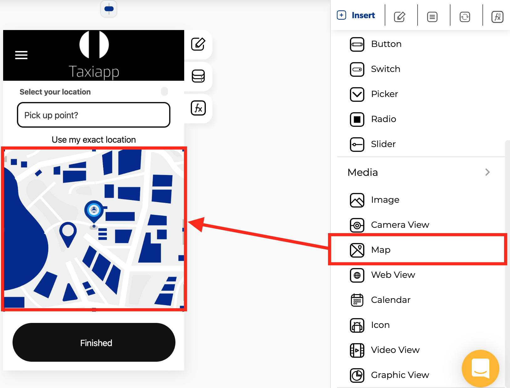

# Map

### 🎨 Styles 

* **Dimensions**
  * **Width:** set how wide the map element is using.
  * **Height:** set how tall the map element is using.

### ⚙ Properties

* **Generic properties**
  * **Enable** [**skeleton loaders**](../../estilos/skeleton-loader.md)**:** this tool provides an indication to the user that something is coming but not yet available on the map element.
  * **Control is hidden:** hide the map element from the screen.


The [**skeleton loader**](../../estilos/skeleton-loader.md) component provides a user with a visual indicator that content is coming/loading. This is better received than traditional full-screen loaders.


* **Specific Properties**
  * **Latitude**: the angular distance, in decimal degrees of a point north or south of the Equator.
  * **Longitude**: the angular distance, in decimal degrees of a point North or South of the prime meridian.
  * **Zoom**: The scale of the map is the ratio of the distance on the map to the distance on the ground.
  * **Is Disabled**: this option restrict the latitude and longitude change.
  * **Map pointer**: Identifies a location on a map. It is a virtual flag in the ground.
  * **Background image**: this property set one background image for map element. 


1.- On your computer, open [Google Maps](https://www.google.com/maps).

2.- Touch and hold an area of the map that isn't labeled. You'll see a red pin appear. 

3.- In the search box at the top, extract your coordinates. Here is an example: [https://www.google.com/maps/place/Apphive/@**19.2853148**,**-99.6548802**,17z/data=!3m1!4b1!4m5!3m4!1s0x85cd89c296ca5367:0xe64e74e07148c6d7!8m2!3d19.2853097!4d-99.6526915](https://www.google.com/maps/place/Apphive/@19.2853148,-99.6548802,17z/data=!3m1!4b1!4m5!3m4!1s0x85cd89c296ca5367:0xe64e74e07148c6d7!8m2!3d19.2853097!4d-99.6526915)


### 👆 Events

* **On region change:** called when ****update your region controlled state values ****with ****has changed.

