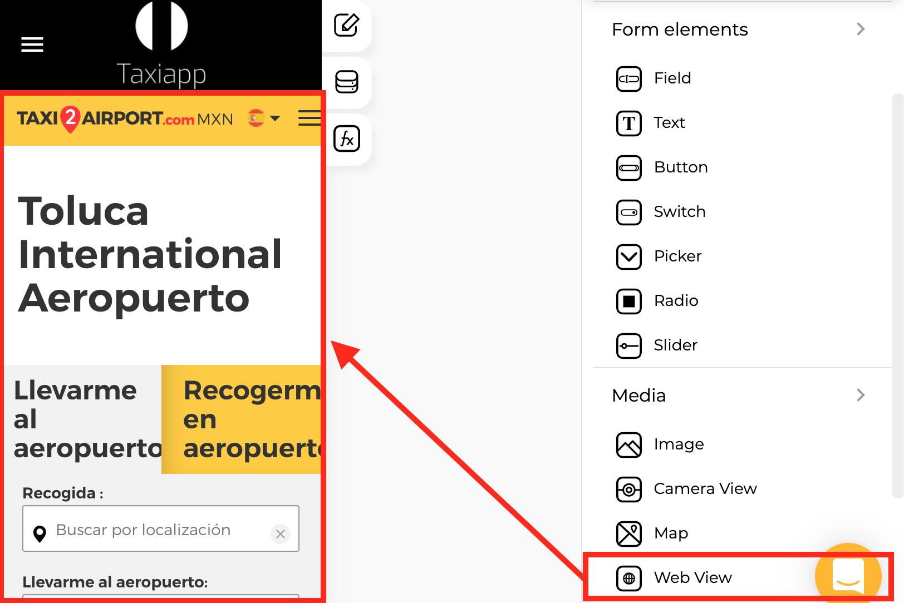

# Web View

### 🎨 Styles 

* **Appearance**
  * **Background color:** select the background color using the [color picker](../../estilos/color-picker.md).
  * **Background image**: this property set one background image for web view element.  
* **Margins**
  * **Padding:** you can specify how much space you want between the border and contents of the web view element.

### ⚙ Properties

* **Generic properties**
  * **Enable** [**skeleton loaders**](../../estilos/skeleton-loader.md)**:** this tool provides an indication to the user that something is coming but not yet available on the web view element.
  * **Control is hidden:** hide the web view element from the screen


The [**skeleton loader**](../../estilos/skeleton-loader.md) component provides a user with a visual indicator that content is coming/loading. This is better received than traditional full-screen loaders.


* **Specific properties**
  * **URL for web view:** The URL is the address of a website. You can find it in the address bar on the top of your top web browser. Alternatively, you can find the URL for a link by right-clicking it and copying the link. 


The web view element only allows certificate Url with https:// Example: [https://apphive.io/](https://apphive.io/) 


### 👆 Events

* **On load:** called ****when screen load completes successfully.

