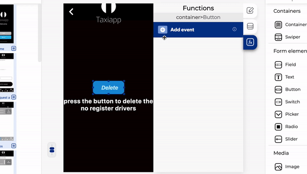

# Delete Database Data

The delete database data is a function in the cloud database functions which allows to the user [delete registers](../../base-de-datos/database/delete-data.md) in the cloud database by pressing a element or loading a screen, this is the most useful function for admins apps because the admin can delete a user or all users and their information.

### 📥 Entry vars 

* **Should update DB cache:** you could activate this function to update de database cache data.
* **Updates to make to the DB:** you can open the database path to view and [modify the database ](../../base-de-datos/database-editor/edit-data.md)
* **Database path:** you can open the [database path](../../base-de-datos/database-editor/open-database-editor.md) to view and modify the database

### \*\*\*\*↗ **Callbacks**

* **Error deleting data:** you can set functions after the database can't be deleted
* **Data deleted:** you can set functions after the database can be deleted.

1. Select the button.
2. Add a on press.
3. Activate the delete database data function
4. Open the [database path](../../base-de-datos/database-editor/open-database-editor.md) and select which [collection](../../base-de-datos/) will be deleted.
5. Add a [new register](../../base-de-datos/database-editor/add-data.md) in cloud database data.
6. Activate the function of should update DB cache.
7. Add a [send alert](../notifications/send-alert.md) on the error deleting data.
8. Activate a [send alert](../notifications/send-alert.md) in the data deleted section.

