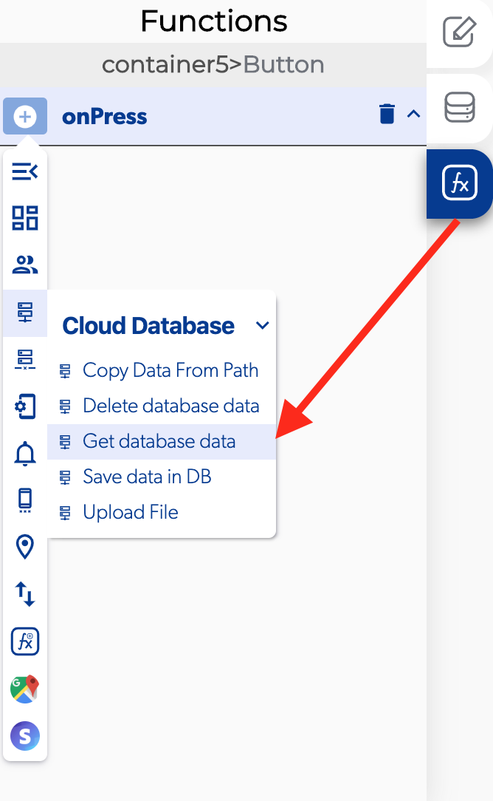

# Get Database Data

The get database data is a function in the [cloud database](./) functions which allows to get register from the cloud database data, this function is very useful because this get information of user, products, settings to show in the app.

### 📥 Entry vars 

* **Filter:**  you can set a filter for the get database data.
* **Is real time:** you can activate this if the register will be consulting in real time.
* **Limit to fist:**  you can set a number to start each consult in the database data.
* **Limit to last:** you can set a number to finish each consult in the database data.
* **Order by:** you can set an order for the consulting in the database data.
* **Database path:** open the [editor](../../base-de-datos/database-editor/edit-data.md) of the database data 
* **Time to refresh \(seconds\):** you can set a number for create a refresh on the consult in database data.

### \*\*\*\*↗ **Callbacks**

* **Permission denied:** you can set functions if there was a problem with a permission to get access to data in database
* **Empty data:** you can set functions if there aren't anything in the database path selected.
* **Data obtained:** you can set functions if the data was obtained successfully from the selected database path.

### 👉 Example.  

#### Use the database element.

1. Activate the [get database data](get-database-data.md) and open database path.
2. Add a collection "Driver list" 
3. Add fields "address, name, phone number, photo and plates"
4. Push the button view data 
5. Press the button Add to add a record to "Driver list".

#### Add a collection to UI.

1. Add a collection to UI in the callback of the get [database data](../../base-de-datos/) when data obtained.
2. Select the previous output get database data in the list data.
3. Click on the button [modify elements](../elements/modify-control.md).
4. Select a container with elements to modify.
5. Click on list data and select the element to modify.
6. Select a control property to change like text.
7. Open the list context and write the name of the element to show in the database.

