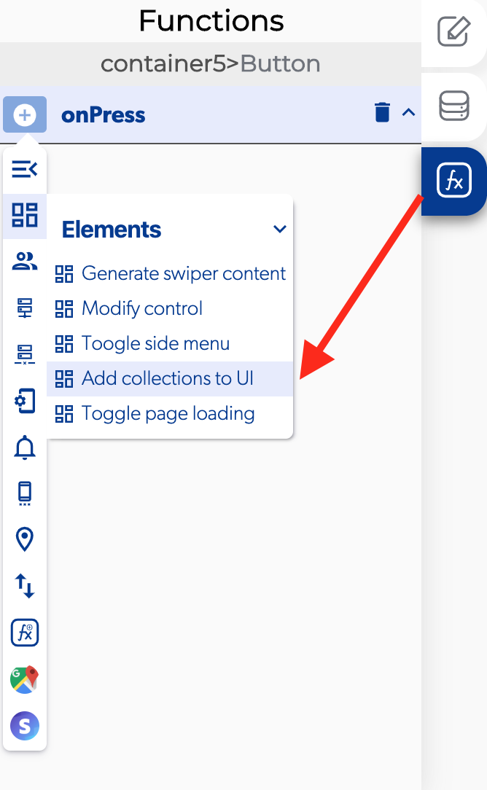

# Add Collections To UI

Agregar colección a la interfaz de usuario es una función en las funciones de [elementos](https://docs.apphive.io/reference/funciones/elements) que permite crear listas de elementos y modificar utilizando los registros en los datos de la [base de datos. ](https://docs.apphive.io/reference/funciones/elements/add-collections-to-ui)

### 📥 Entry vars  \(Variables de entrada\) 

* **Enable horizontal:** puede seleccionar para ver su lista de forma horizontal
* **List data:** seleccione la salida para recuperar la lista.
* **List instructions.** 
* **Modify element:** abre un modificador en los elementos de tu lista.
* **List reverse:** cambiar el orden de los elementos de la lista.
* **Scroll inverted:** cambiar la dirección del desplazamiento en la lista.

### 👉 Ejemplo.  

**Utilice el elemento de la base de datos**.

1. Activate the [get database data](../cloud-database/get-database-data.md) and open database path.
2. Add a collection "Driver list" 
3. Add fields "address, name, phone number, photo and plates"
4. Push the button view data 
5. Press the button Add to add a record to "Driver list".

#### Add a collection to UI.

1. Add a collection to UI in the callback of the get [database data](../../base-de-datos/) when data obtained.
2. Select the previous output get database data in the list data.
3. Click on the button [modify elements](modify-control.md).
4. Select a container with elements to modify.
5. Click on list data and select the element to modify.
6. Select a control property to change like text.
7. Open the list context and write the name of the element to show in the database.

