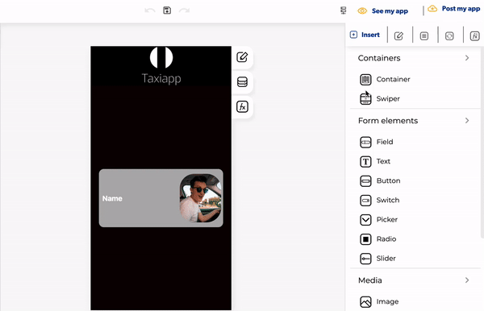

# Toggle Side Menu

El menú lateral de alternancia es una función en las funciones de los [elementos ](https://docs.apphive.io/reference/funciones/elements)que permite al usuario abrir un menú lateral para acceder a un menú de inicio rápido.

#### Cómo abrir la barra de navegación izquierda

1. Haga clic en el botón de menú.
2. Activar la barra de navegación izquierda.
3. Haga clic en el botón de navegación izquierdo para modificar este elemento.

### ↗ Callbacks \(Devoluciones de llamada\) 

* **Error al abrir el menú lateral:** puede configurar funciones si el menú lateral no se abre correctamente.
* **Menú lateral abierto:** puede configurar funciones después de que el menú lateral se abra correctamente.

###  👉 Ejemplo.  

