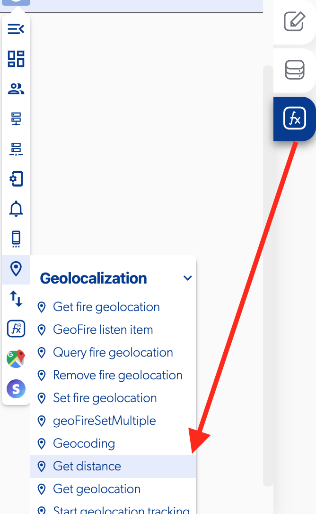

# Get Distance

### 📥 Entry vars 

* **Latitude destination:**  you can set the latitude destination point.
* **Longitude origin:** you can set the longitude origin point.
* **Longitud destination:** you can set the longitude destination point.
* **Longitude origin:** you can set the longitude origin point.
* **Mode \(Linear/Route\):** you can select between Linear or Route to get the distance from origin point to destination point.

### \*\*\*\*↗ **Callbacks**

* **Error:** you can set functions if there was a problem getting distances between an origin point and a destination point.
* **Success:** you can set functions if successfully get distance between an origin point and a destination point.

