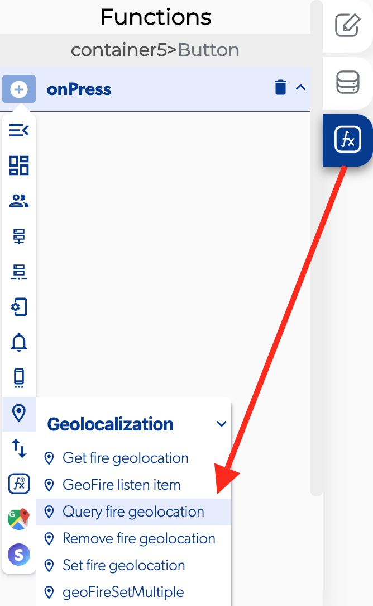

# Query Fire Geolocation

### 📥 Entry vars 

* **Group name:** you can add a group name from the apps settings.
* **Center latitude:** you can add a center to the latitude with this format 19.2853148
* **Center longitude:** you can add a center to the longitude with this format -99.6548802
* **Radius \(Km\):** you can set a radius using Km format like 100 Km

### \*\*\*\*↗ **Callbacks**

* **Error at make query:** you can set functions after here was an error while performing this query.
* **New key location entered:** You can set functions after there was a modification on the key location.
* **Key location exited:** you can set functions after the location of a key no longer matches the query criteria.
* **Key location moved:**  you can set functions if the location of a key changed but the location still matches the query criteria. 

