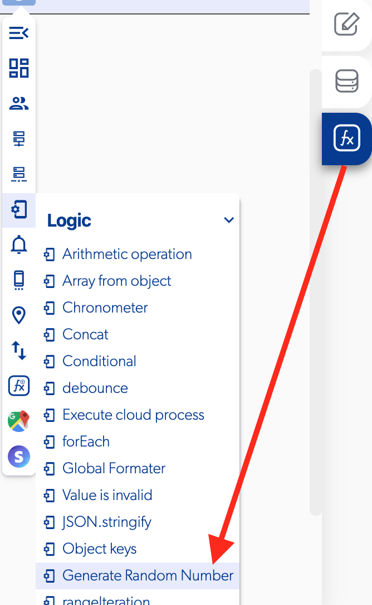

# Generate Random Number

### 📥 Entry vars 

* **Max number:** the max number is the element that the user set the largest value in the input.
* **Minimum number:** the min number is the element that the user set the largest value in the input.

### \*\*\*\*↗ **Callbacks**

* **Successfully generated:** you can set functions if the random number is successfully generated.

