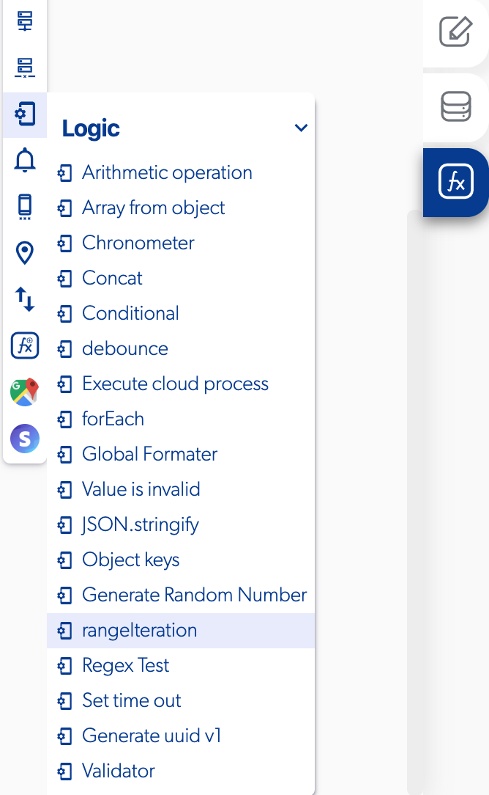

# Range Iteration

### 📥 Entry vars 

* **End:** you can set where the rage iteration ends.
* **Interval:** you can set where the interval will be.
* **Start:** you can set where the range iteration start.

### \*\*\*\*↗ **Callbacks**

* **Error:** you can set functions when the range iteration have an error.
* **On finish:** you can set functions when the range iteration finish the process.
* **Iteration:** you can set functions during the iteration process.

