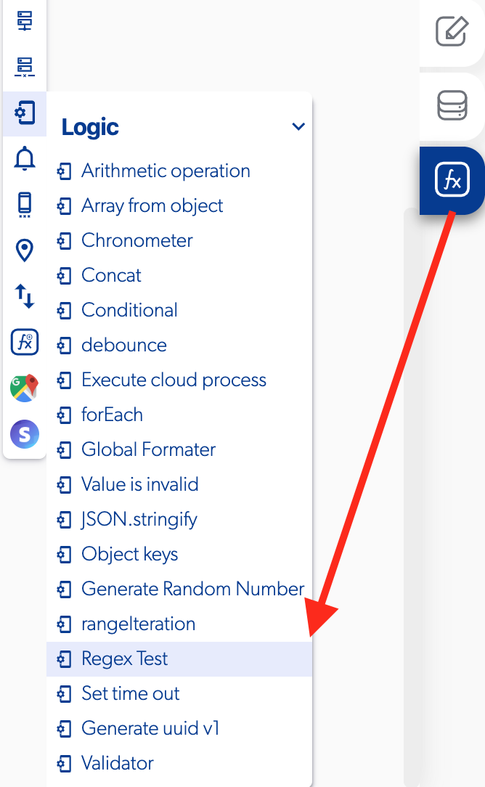

# Regex Test

### 📥 Entry vars 

* **Basic regex** : you can set a regex basic value like email, only numbers, only letters, at least three characters, 10 digits phone, 12 digits phone with country code.
* **Custom regex:** you can set a custom regex value for the test.
* **String to value:** select the string for the regex test.

### \*\*\*\*↗ **Callbacks**

* **Does not match:** you can set functions after the regex test show a not match values.
* **Match:** you can set functions after the regex test show match values.

