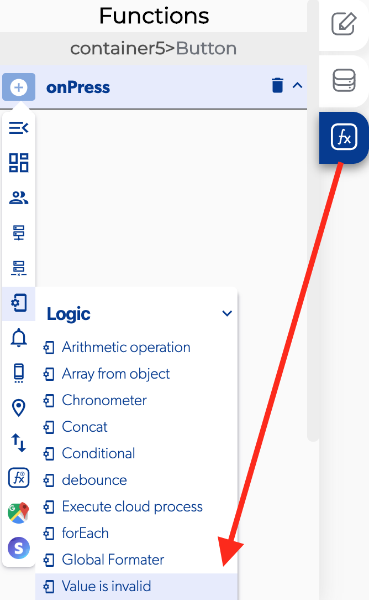

# Value Is Invalid

### 📥 Entry vars 

* **Variable to validate:** select with element has restricted values.

### \*\*\*\*↗ **Callbacks**

* **Is a valid value:** the max number is the element that the user set the largest value in the input.
* **Is an invalid value:** you can set functions if the value entered by the user is invalid.

