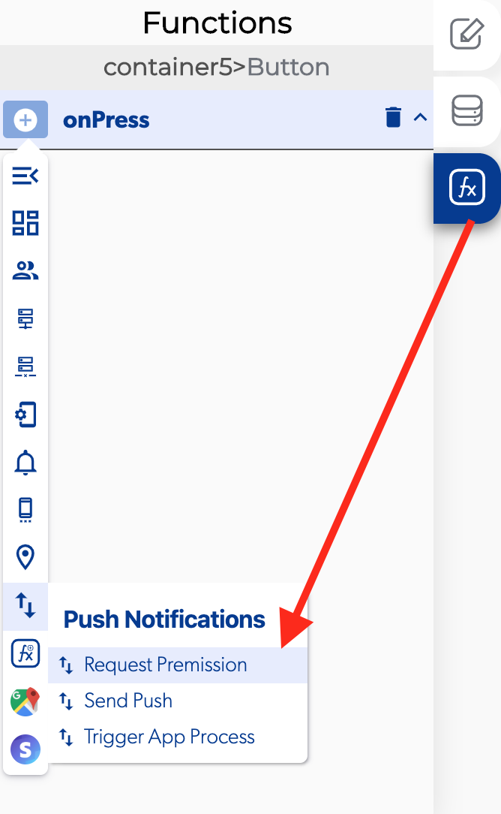

# Request Permission

### \*\*\*\*↗ **Callbacks**

* **Error:** you can set function if there is a problem requesting permission to the user.
* **Success:** you can set functions If it's successfully sending the request permission.

