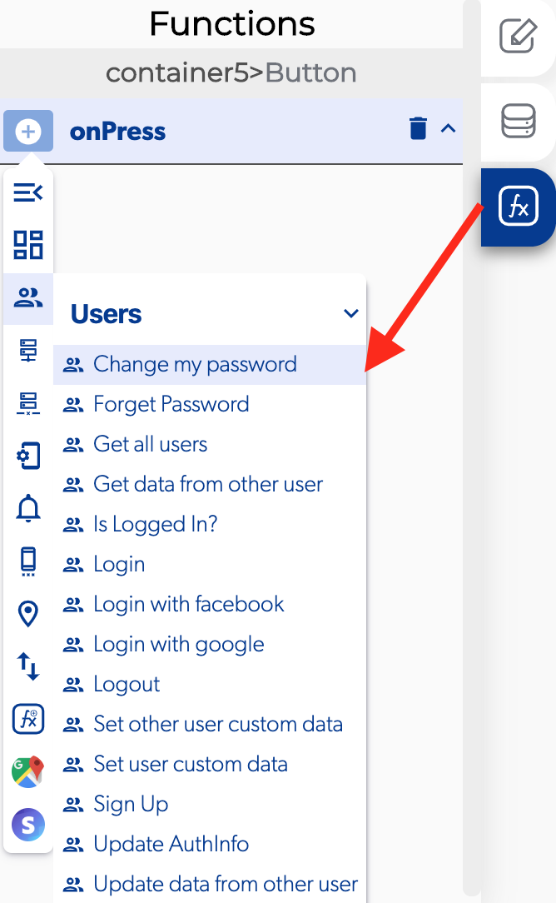

# Change My Password

The change my password is a function in the [users](./) functions which allows to the users change their password, this function is important to the users to secure their account.

### 📥 Entry vars 

* **New password:** select a text field to provide a way for the user to change the password.

### ↗ Callbacks 

* **Error changing password:** you can set functions after the user can't change his password.
* **Password changed successfully:** you can set functions after the user can change his password.

### 👉 Example.  

#### User is logged in and change password

1. Select the button
2. Add a [is logged in?](is-logged-in.md) function to verify if the user is logged
3. Open the callbacks to add a change password in the user is logged in.
4. Select the element for the user to fill with the new password.
5. Open the callbacks on the password changed successfully and add a [logout](logout.md).
6. Add a [replace screen](../navigation/replace-screen.md) in the successful logout.

