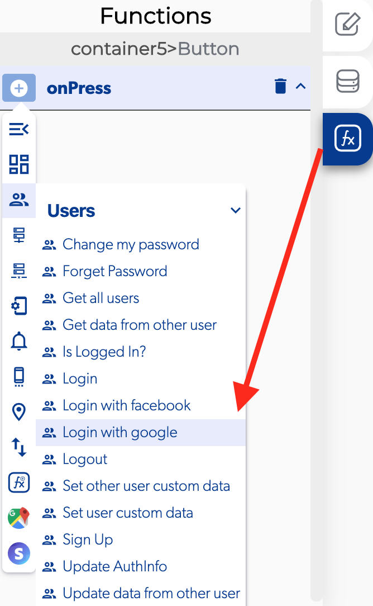
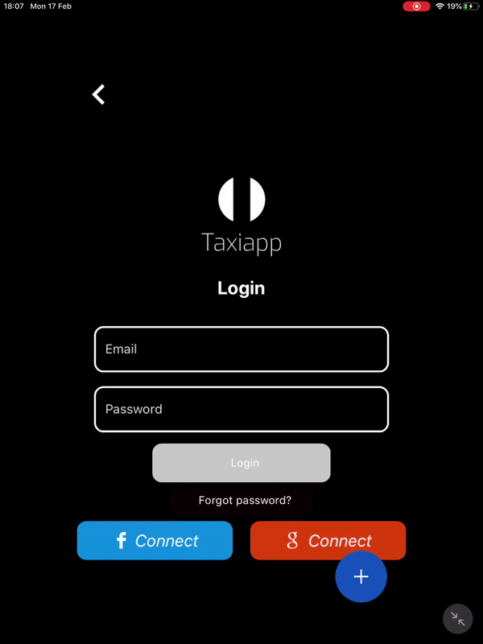

# Login With Google

The login with Google is a function in the [users](./) functions which allows to the users login by identifying and authenticating themselves with a Google account.

### 📥 Entry vars 

* **Should always select account:** this function allow the user to select the Google account to login in the app.

### ↗ Callbacks 

* **Error login with google:** you can set functions after the user can't login to the app with Google.
* **In progress:** you can set functions during the user try to login in the app with Google.
* **Play services not available:** you can set functions during process to login with a Google account but the Play Services isn't available.
* **Sign in cancelled:** you can set functions after the user can't login to the app with Google account because he cancel the login.
* **Successful login wit Google:** you can set functions after the user login to the app with Google account.

1. Select a button to add a login with Google function and select on press.
2. Activate a [toggle page loading](../elements/toggle-page-loading.md) and select only enable.
3. Add a login with Google function.
4. Activate the should always select account for user.
5. Open the callbacks and add a [toggle page loading](../elements/toggle-page-loading.md) and activate on disable in the successful login with google
6. Activate a [replace screen](../navigation/replace-screen.md) function and select which screen will go after the login with Google.

