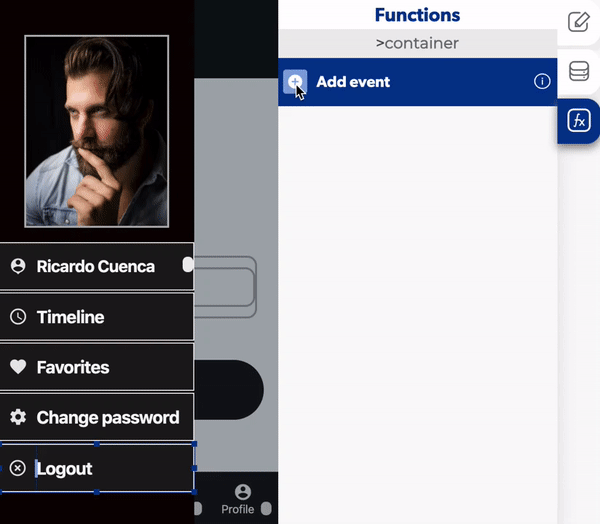

# Logout

The logout is a function in the [users](./) functions which allows to get out from the app to exit his identification and authentication. The user usually use this function to avoid the push notifications or change accounts.

### ↗ Callbacks 

* **Error logout:** you can set functions after the user can't log out from the app.
* **Successful logout:** you can set functions after the user log out from the app.

1. Select a button and add an on press.
2. Activate a [replace screen](../navigation/replace-screen.md) in the successful logout.
3. Select which screen the user will see after he logout.

