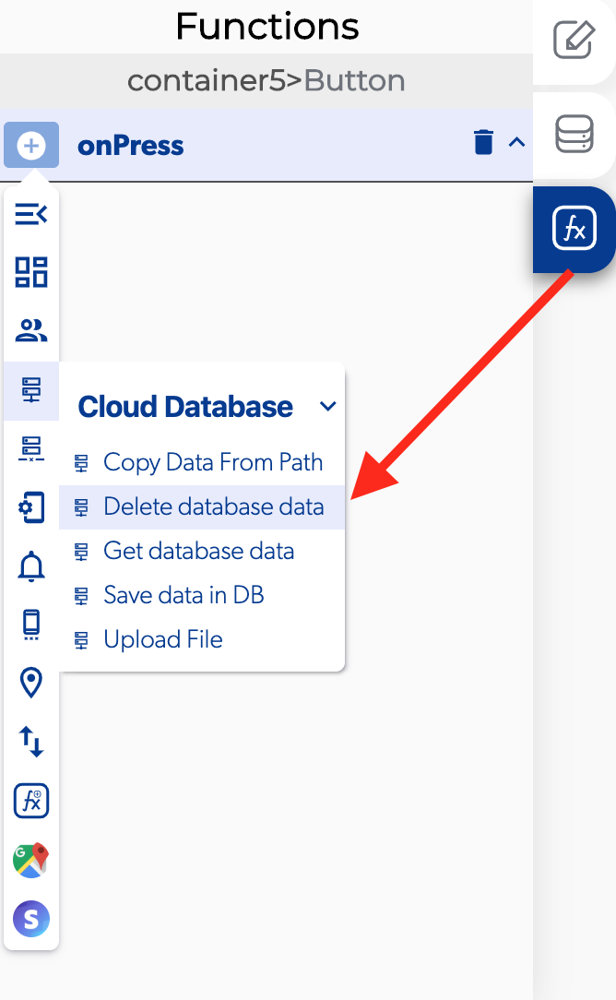
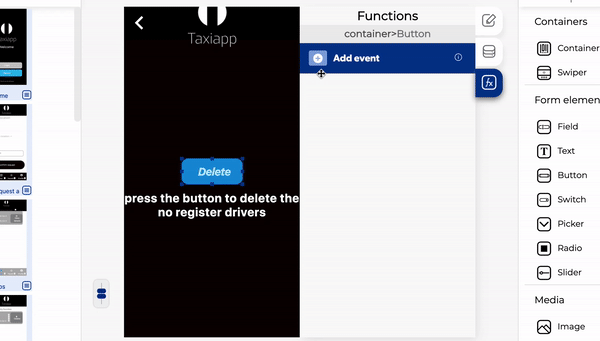

# Delete Database Data

### 📥 Entry vars 

* **Should update DB cache:** you could activate this function to update de database cache data.
* **Updates to make to the DB:** you can open the database path to view and modify the database 
* **Database path:** you can open the database path to view and modify the database

### \*\*\*\*↗ **Callbacks**

* **Error deleting data:** you can set functions after the database can't be deleted
* **Data deleted:** you can set functions after the database can be deleted

