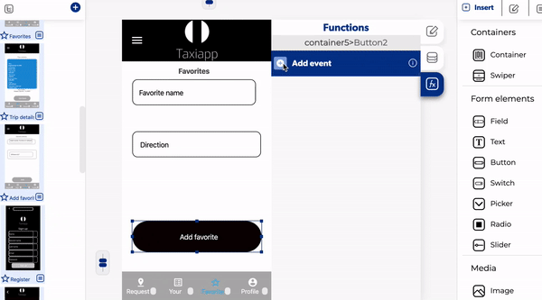

# Save Data in Database

The save data in database is a function in the [elements](../elements/) functions which allows to create lists of elements and modify using the registers on the [database data.](../../database/) 

The basic database write operation is a set which saves new data to the specified database reference, replacing any existing data at that path.

### 📥 Entry vars 

* **Should update DB cache:** you could activate this function to update de database cache data.
* **Updates to make to the DB:** you can open the database path to view and modify the database.
* **Database path:** you can open the database path to view and modify the database.

### \*\*\*\*↗ **Callbacks**

* **Error saving data:** you can set functions after the database can't be saved.
* **Data saved:** you can set functions after the database can be saved. 

### 👉 Example.  

1. Select a button on the screen.
2. Put a on press in functions menu.
3. Activate a save data in database.
4. Open the [database path](../../database/database-editor/open-database-editor.md).
5. Create a favorite collection.
6. Create two fields, firstly name and secondly direction.
7. Select which element will be used for input on the controller menu.
8. Open the callbacks of in save data in database and add a [send alert](../notifications/send-alert.md).
9. Put OK in the title of the send alert.

