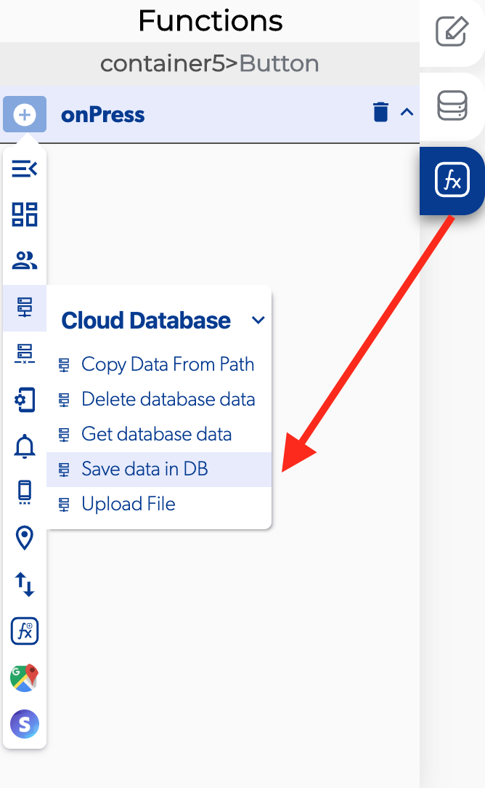

# Save Data in Database

### 📥 Entry vars 

* **Should update DB cache:** You could activate this function to update de database cache data.
* **Updates to make to the DB:** You can open the database path to view and modify the database.
* **Database path:** You can open the database path to view and modify the database.

### \*\*\*\*↗ **Callbacks**

* **Error saving data:** You can set functions after the database can't be saved.
* **Data saved:** You can set functions after the database can be saved.

