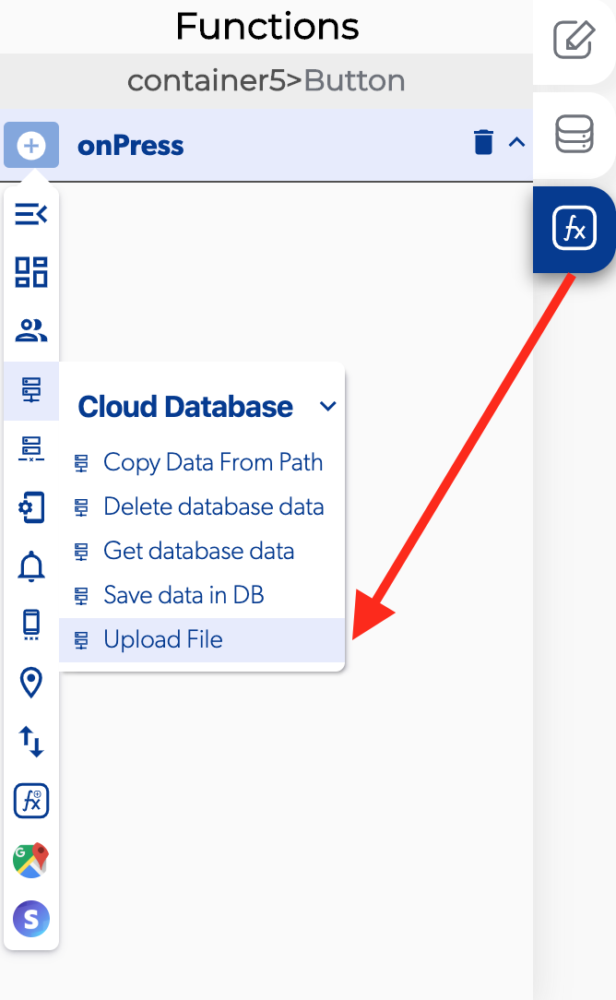

# Upload File

### 📥 Entry vars 

* **Permission request message**
* **Permission request title**
* **URL**

### \*\*\*\*↗ **Callbacks**

* **Error uploading file**
* **File uploaded**

### 📤 Out vars 

* **URL** 
* **Download URL**

