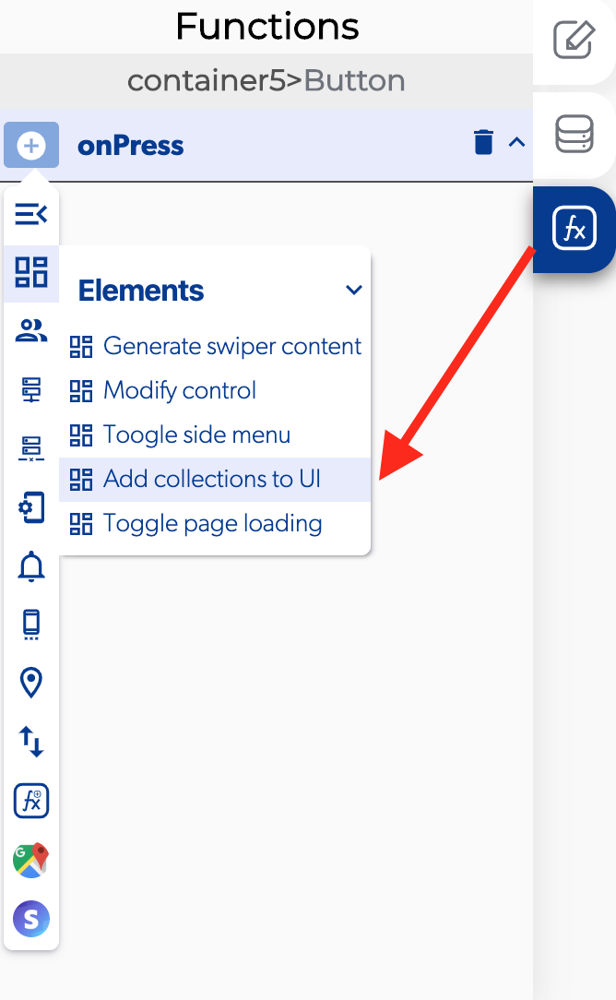

# Add Collections To UI

### 📥 Entry vars 

* **Enable horizontal:** you can select to see you list in a horizontal way
* **List data:** select the output for retrieve the list.
* **List instructions.** 
* **Modify element:** open a modifier on elements in your list.
* **List reverse:** change the order of the elements on the list.
* **Scroll inverted:** change the direction of the scroll in the list.

\*\*\*\*

