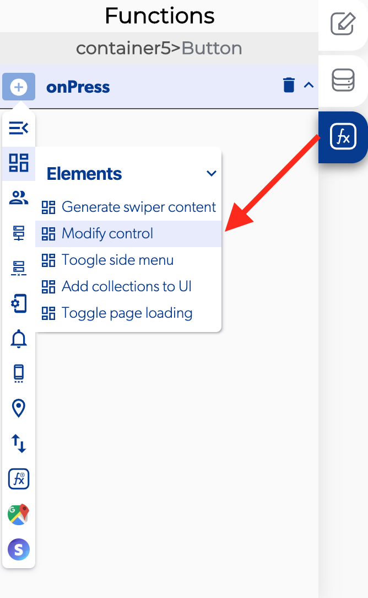

# Modify Control

Modify control data is a function on the [Elements group](./) witch allows you to modify any control on the current page

###  ​​ 📥 Entry vars 

* **Data to send.** Enter the data to be modified on the control
* **Element.** Select the control you want to modify
* **Property to modify.** Pick the property to be modified on the control


To make easier to identify the control to select you can rename the control name


### ​​ 👉 Examples. 

#### Modify text 

