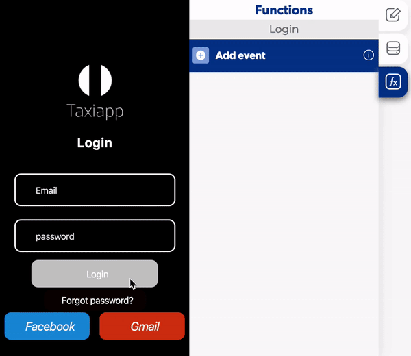

# Toggle Page Loading

#### Activate a toggle page loading

1. Select and element and add a toggle page loading.
2. Activate the option only enable.

#### Activate a Login function

1. Add a login function.
2. Select which element the user will use to write an email.
3. Select which element the user will use to write a password.
4. Open the callbacks on the login.
5. Add another toggle page loading in the successful login.
6. Activate the option only disable.


You can select which loader do you need in the settings page.



Download loaders in: [https://lottiefiles.com/](https://lottiefiles.com/)


### 📥 Entry vars 

* **Only disable:**  if you activate the option disable you can turn off the toggle page loading function.
* **Only enable:** if you activate the option enable you can turn on the toggle page loading function.

