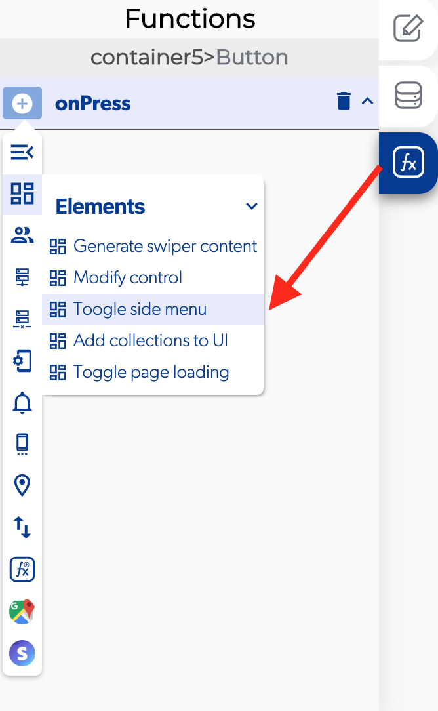
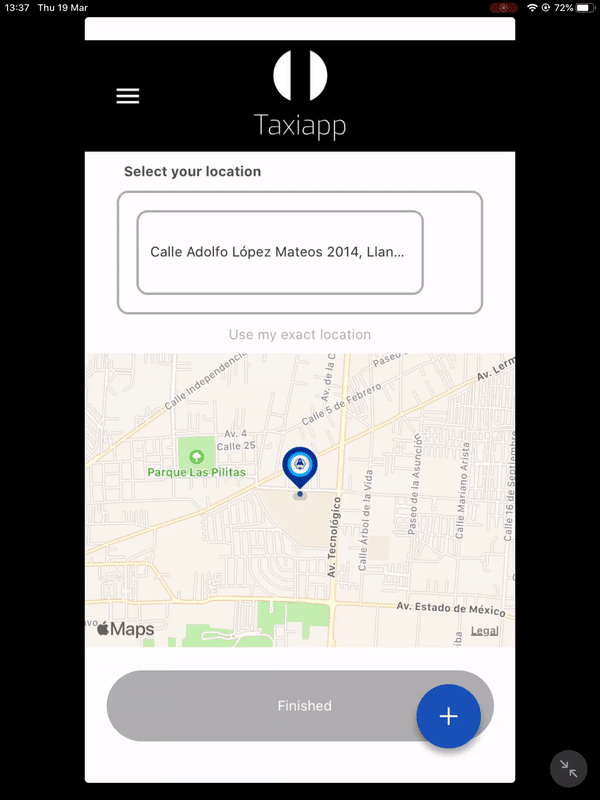

# Toggle Side Menu

The toggle side menu is a function in the [elements](./) functions which allows to the user open a side menu to get an access to a quick launch menu.

### ↗ Callbacks 

* **Error opening side menu:** you can set functions if the side menu isn't opened correctly.
* **Side menu opened:** you can set functions after the side menu is opened correctly.

###  👉 Example.  

