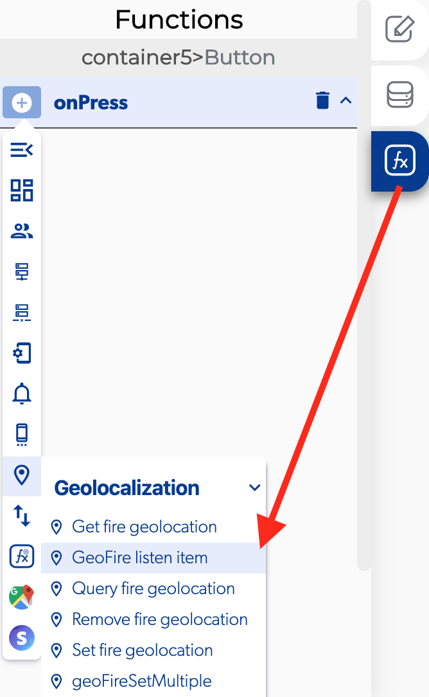

# Geo Fire Listen Item

### 📥 Entry vars 

* **Group name:** you can add a group name from the apps settings.
* **Item key:** 

### \*\*\*\*↗ **Callbacks**

* **No Item:** you can set functions if there is no Item in the geolocation map.
* **On Item Move:** you can set functions if the Item is moving.

