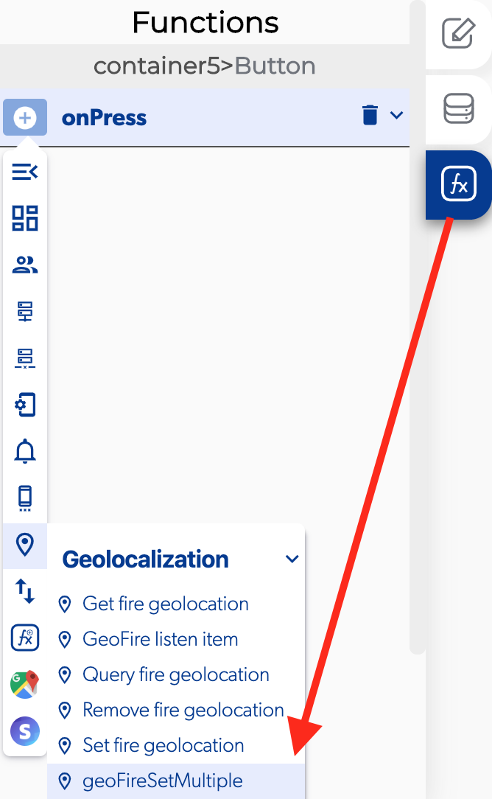

# Geo Fire Set Multiple

### 📥 Entry vars 

* **Collection:** select the elements or saved geolocation for the database
* **Group name:** you can add a group name from the apps settings.
* **Path to location:** Open the database from a function

### \*\*\*\*↗ **Callbacks**

* **Error process**: you can set functions after there was an error processing multiple geolocations.
* **Success process:** you can set functions after successfully process multiple geolocations.

