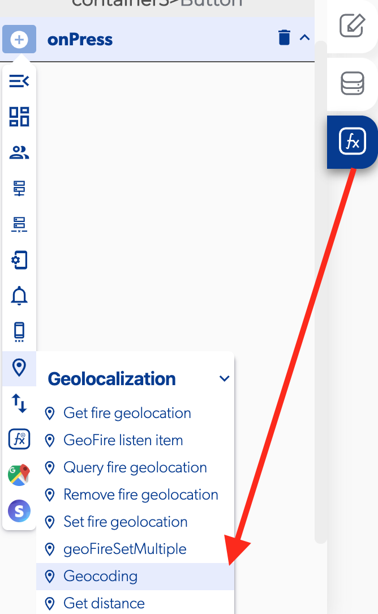

# Geocoding

### 📥 Entry vars 

* **Latitude:** you can add a latitude point with this format 19.2853148
* **Longitude:** you can add a longitude point with this format -99.6548802

### \*\*\*\*↗ **Callbacks**

* **Error:** you can set functions if there was an error processing the geocoding location point.
* **Success:** you can set functions if successfully process the geocoding location point.

