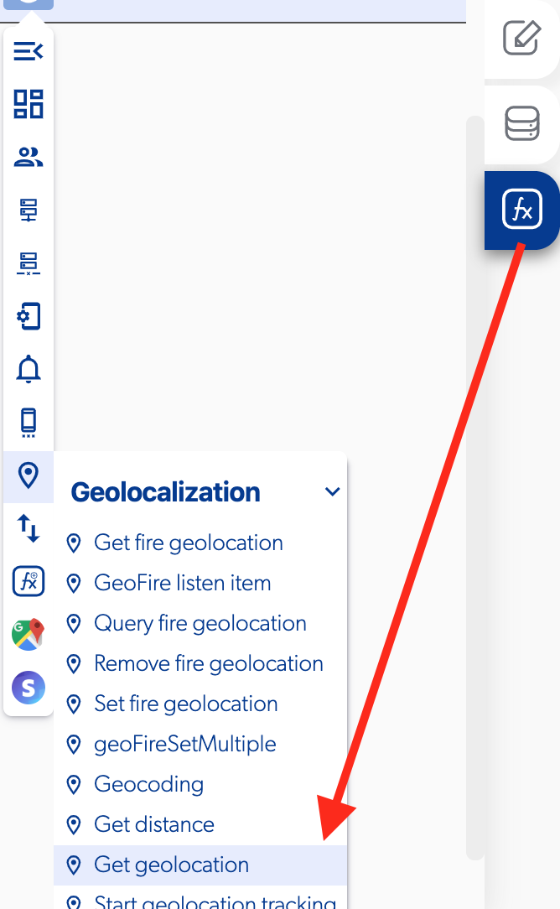

# Get Geolocation

### 📥 Entry vars 

* **Desired accuracy \(Low power, Balanced power, High power\)**
* **Permission request message**
* **Permission request title**

### \*\*\*\*↗ **Callbacks**

* **Geolocation error**
* **Geolocation success**

### 📤 Out vars 

* **Latitude**
* **Longitude**

