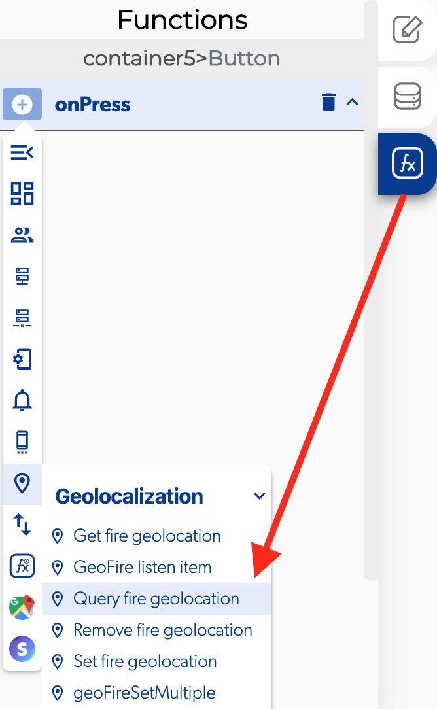

# Query Fire Geolocation

### 📥 Entry vars 

* **Group name**
* **Center latitude**
* **Center longitude**
* **Radius \(Km\)**

### \*\*\*\*↗ **Callbacks**

* **Error at make query**
* **New key location entered**
* **Key location exited**
* **Key location moved**

### 📤 Out vars 

* **Key location**
* **Latitude**
* **Longitude**

