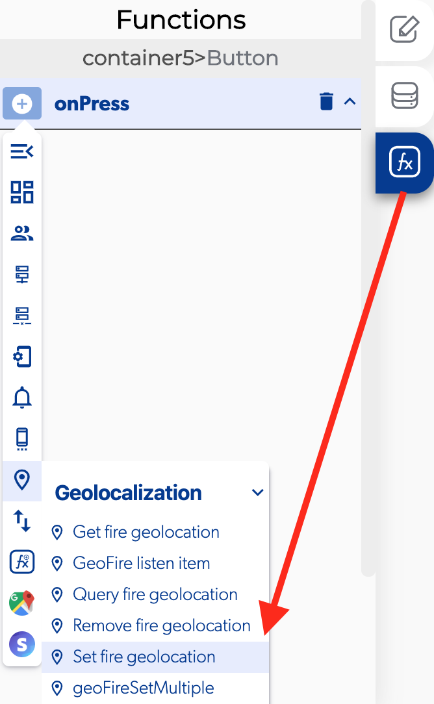

# Set Fire Geolocation

### 📥 Entry vars 

* **Group name:** you can add a group name from the apps settings.
* **Key location**: 
* **Latitude:** you can add a latitude with this format 19.2853148
* **Longitude:** you can add a longitude with this format -99.6548802

### \*\*\*\*↗ **Callbacks**

* **Error at set location:** you can set functions if there was a error setting a geolocation.
* **Success at set location:** you can set functions if it was successfully saved and set a geolocation.

