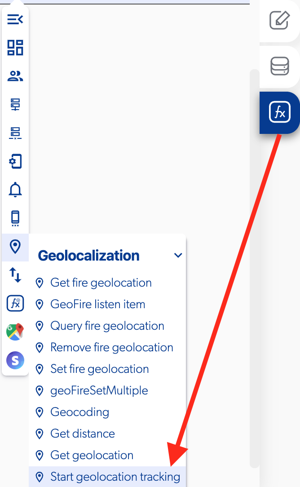

# Start Geolocation Tracking

### 📥 Entry vars 

* **Select desired accuracy \(Very low, Low, Medium, High\)**
* **Distance filter**
* **Should show debug notifications**
* **Stop on terminate**

### \*\*\*\*↗ **Callbacks**

* **Error getting location**
* **On location change**

### \*\*\*\*📤 Out vars 

* **Latitude**
* **Longitude**

