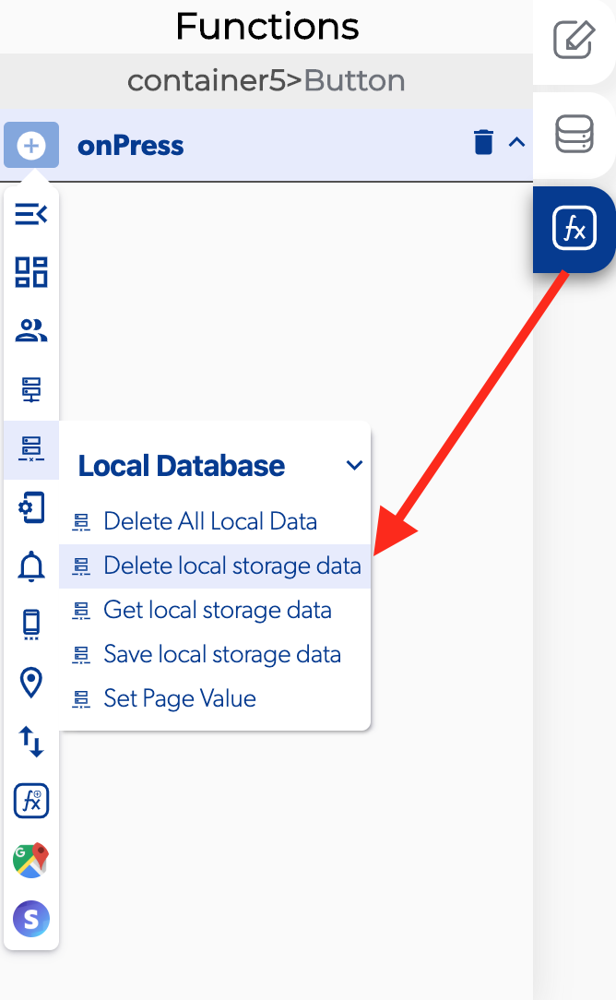

# Delete Local Storage Data

### 📥 Entry vars 

* **Updates to make to the local storage**
* **Database path:** You can open the database path to view and modify the database.

### \*\*\*\*↗ **Callbacks**

* **Error deleting data:** You can set functions after there was a error on delete local storage data.
* **Success retrieving data:** You can set functions after delete local storage data.

