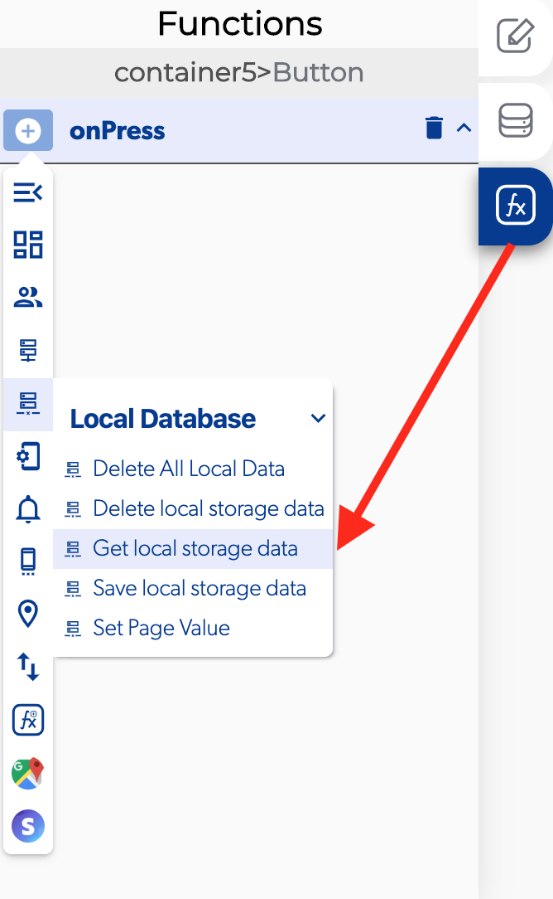

# Get Local Storage Data

### 📥 Entry vars 

* **Is real time:** you can activate this option if you want update your app with the local storage data.
* **Path on local storage:** you can open the local database path to view and modify the local database.
* **Database path:** you can open the database path to view and modify the database.

### \*\*\*\*↗ **Callbacks**

* **Error retrieving data:** you can set functions after there was an error on retrieving data from the local storage data.
* **Empty data:** you can set functions when there wasn't nothing on the local storage data.
* **Success retrieving data:** you can set functions when you already get local storage data from the database.

