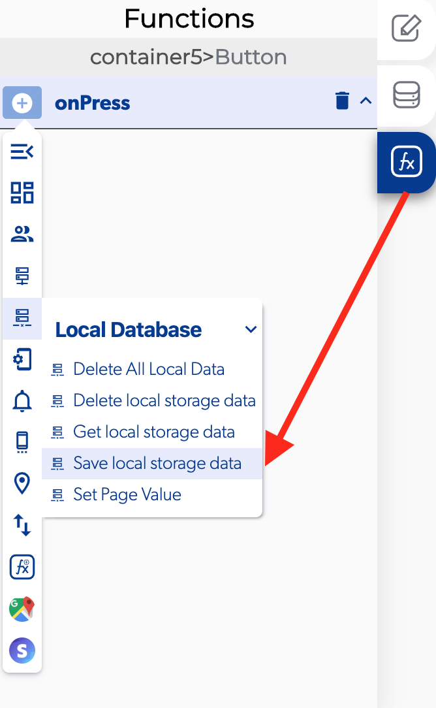

# Save Local Storage Data

### 📥 Entry vars 

* **Updates to make to the local storage:** you can set functions after  was an error saving data in the local storage data.
* **Database path:** you can open the database path to view and modify the database.

### \*\*\*\*↗ **Callbacks**

* **Error saving data:** you can set functions after it was an error saving data in the local storage data.
* **Data saved:** you can set functions after save data in the local storage data.

