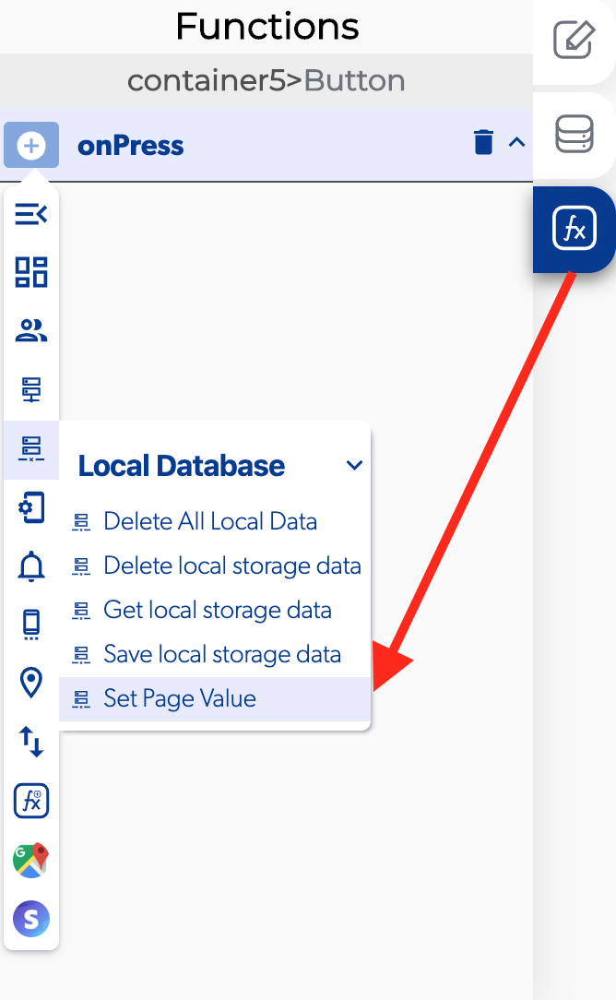

# Set Page Value

###  

### 📥 Entry vars 

* **Key:** A key is a special attribute you need to include when creating lists of elements. Keys are used to identify which items in the list are changed, updated or deleted.
* **Value:** When the value is updated the component perform some action to modify the element.

