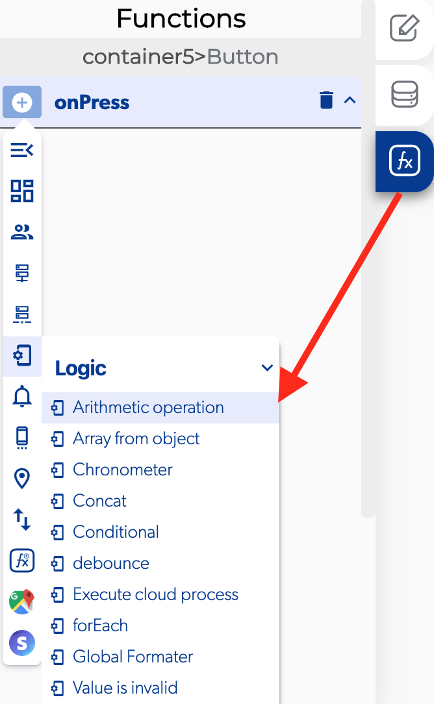

# Arithmetic Operation

### 📥 Entry vars 

* **Operating A:** first element with a value to the operation process.
* **Operating B:** second element with a value to the operation process.
* **Operating C:** third element with a value to the operation process.
* **Operating D:** fourth element with a value to the operation process.
* **Operator +:** the symbol \(+\) indicating summation or a positive quality.
* **Operator - :** the symbol \(−\) denoting subtraction or a negative quantity.
* **Operator \*:** the symbol \(∗\) two elements, denoting multiplication of the second by the first element value.
* **Operator / :** the symbol \(/\) placed between two elements and denoting division of the first by the second element value.

