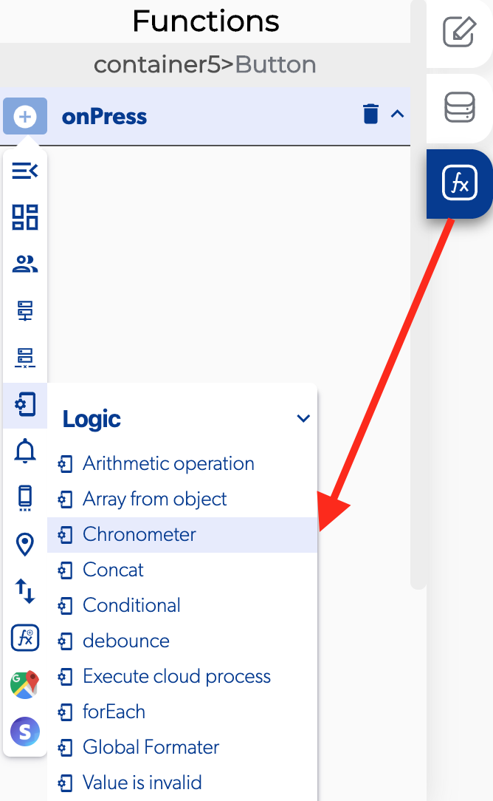

# Chronometer

### \*\*\*\*↗ **Callbacks**

* **Error at start / stop Chronometer:** You can set functions after there was a error when you start or stop the chronometer.
* **Chronometer started / stopped:** You can set functions after the moment you start or stop the chronometer

