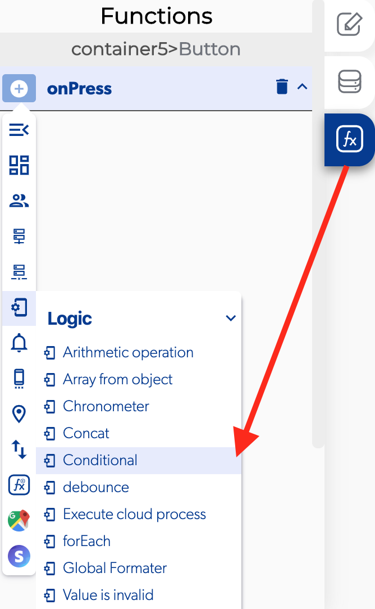

# Conditional

### 📥 Entry vars 

* **Value A**
* **Value B**
* **Operator \(Equal to, Greater than, Less than, Greater than or equal to, Less than or equal to, Not Equal to\)**

### \*\*\*\*↗ **Callbacks**

* **Is false**
* **Is true**

### 📤 Out vars 

* **Result**

