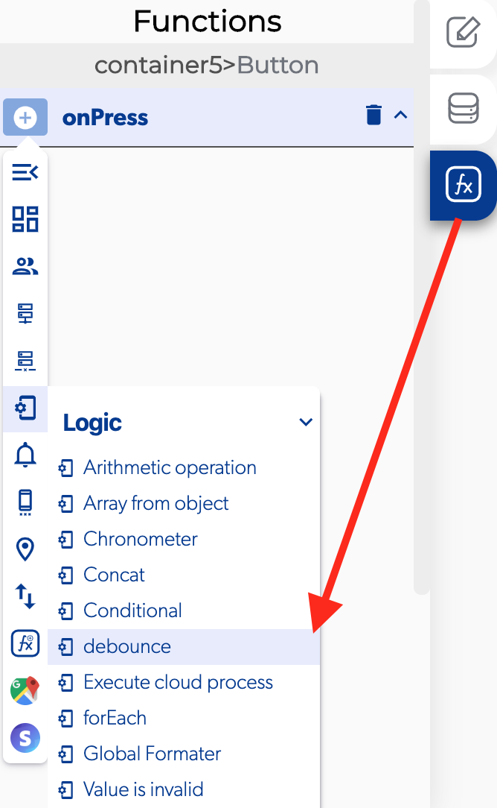

# Debounce

### 📥 Entry vars 

* **Time milliseconds:** the function to execute and the fire functions on a rate limit in milliseconds.

### \*\*\*\*↗ **Callbacks**

* **Activated:** you can set functions when the debounce finish.

