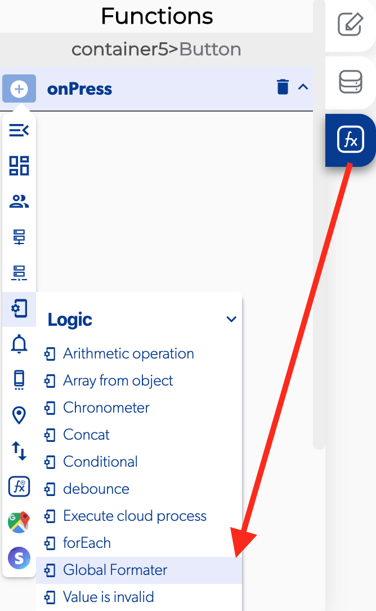

# Global Formater

### 📥 Entry vars 

* **Origin data**
* **Origin type**
* **Origin type detail**
* **Target type**
* **Target type detail**

### \*\*\*\*↗ **Callbacks**

* **Error**
* **Success**

