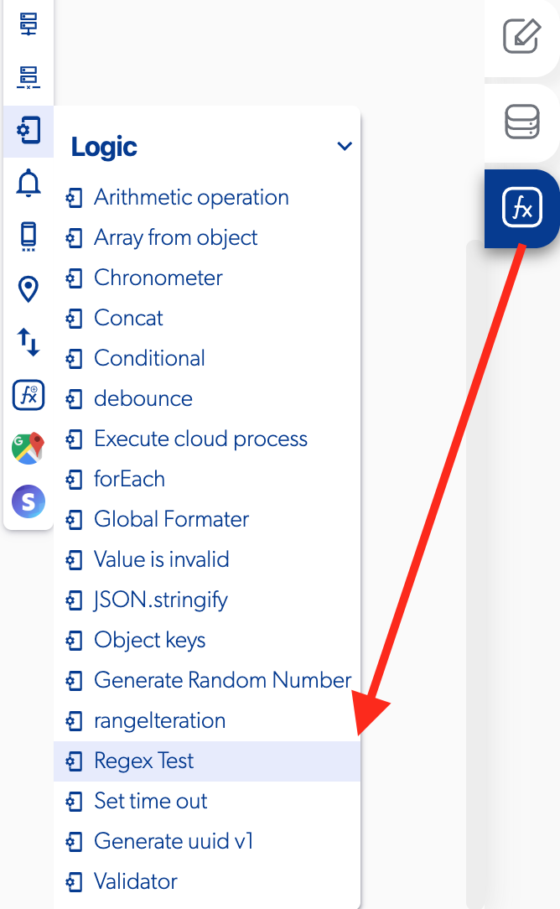

# Regex Test

### 📥 Entry vars 

* **Basic regex \(Email, Only numbers,Only letters, At least three characters\)**
* **Custom regex**
* **String to evalue**

### \*\*\*\*↗ **Callbacks**

* **Does not match**
* **Match**

### 📤 Out vars 

* **Result**

