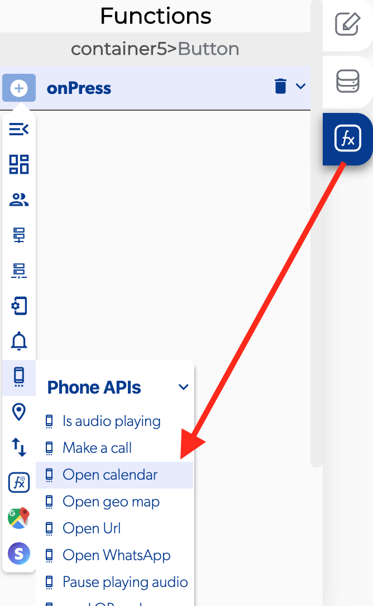

# Open Calendar

### \*\*\*\*↗ **Callbacks**

* **Error opening calendar:** you can set functions when there is a problem opening the mobile calendar
* **Calendar opened:** you can set functions after open the mobile calendar.

