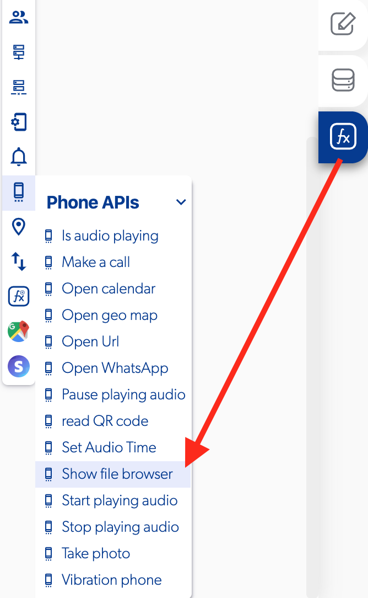

# Show File Browser

### 📥 Entry vars 

* **Select multiple files**
* **File type \(All files, Audio, Images, PDF, Plain Text\)**

### \*\*\*\*↗ **Callbacks**

* **Error retrieving file**
* **File retrieved**

### 📤 Out vars 

* **URL file**

