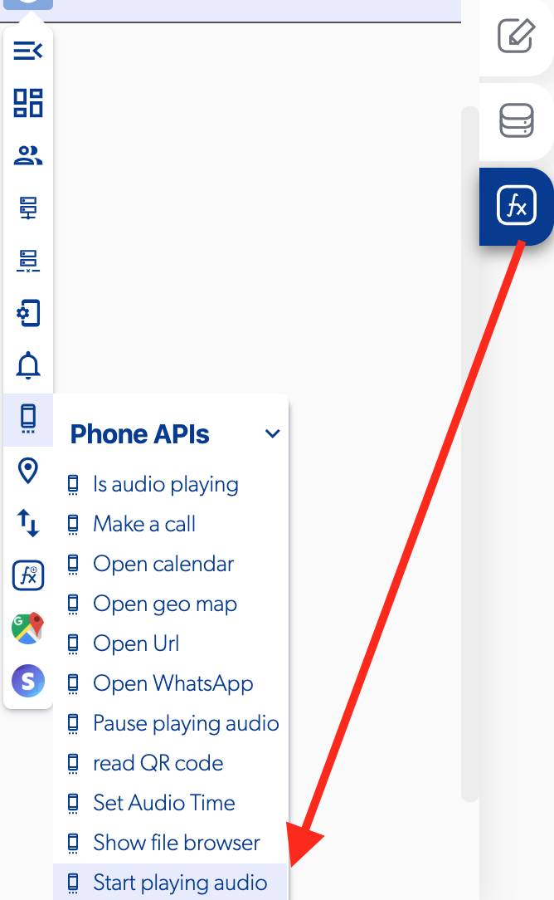

# Start Playing Audio

### 📥 Entry vars 

* **URI:** is an identifier of a specific resource. Like a page, or book, or a document in this case for audio resources.

### \*\*\*\*↗ **Callbacks**

* **Play time update:** you can set functions when the audio. 
* **Start playing:** you can set functions simultaneous when the audio will start playing.
* **Stop playing:** you can set functions simultaneous when the audio will stop.

