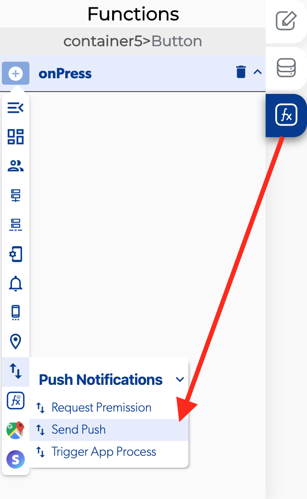

# Send Push

### 📥 Entry vars 

* **Body:** You can set a message to push notification for the user.
* **Target app:** you can set with app will get the push notification between the apps in your project.
* **Target user email:** you can select which email can get a push notification usually select the user email to recibe that notification.
* **Target user ID:** you can select which user can get the push notification usually select the user ID to recibe that notification.
* **Title:** you can set a tittle to push notification for the user.

