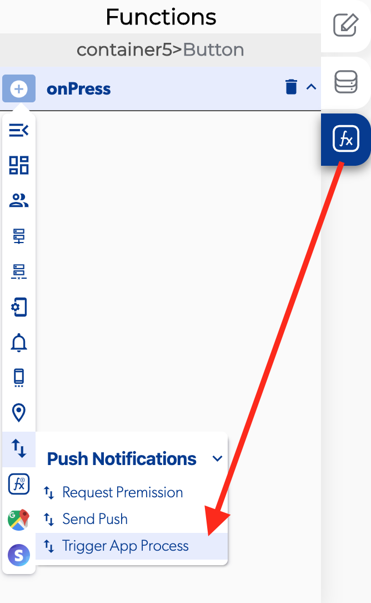

# Trigger Apps Process

### 📥 Entry vars 

* **Target apps:** you can set with app will get the push notification between the apps in your project.
* **Target user email**: you can select which email can get a push notification usually select the user email to recibe that notification.
* **Target user ID:** you can select which user can get the push notification usually select the user ID to recibe that notification.

### \*\*\*\*↗ **Callbacks**

* **Error:** you can set functions if there is an error triggering the push notification.
* **Success:** you can set functions if successfully send the trigger push notification.

###  

