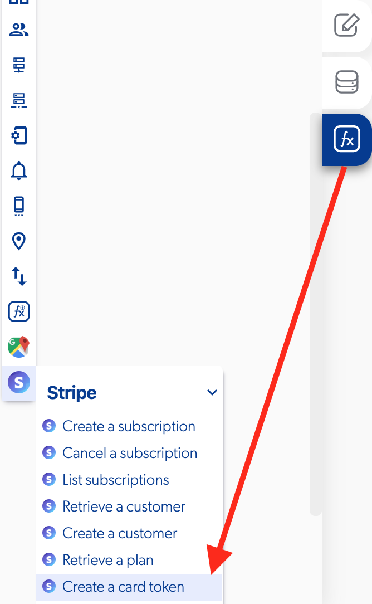

# Create a Card Token

### 📥 Entry vars 

* **Address ZIP**
* **CVC**
* **Card holder**
* **Exp. month** 
* **Exp. year** 
* **Card number**

### \*\*\*\*↗ **Callbacks**

* **Error**
* **Success**

