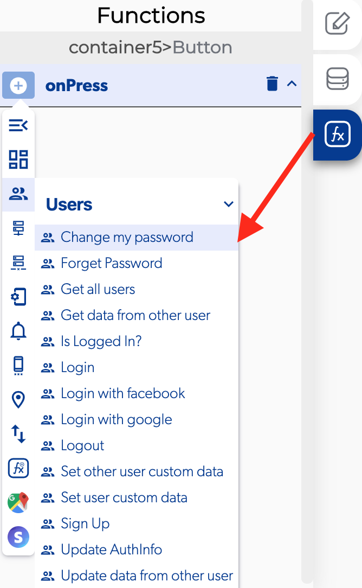

# Change My Password

### 📥 Entry vars 

* **New password:** Select a text field to provide a way for the user to change the password.

### ↗ Callbacks 

* **Error changing password:** You can set functions after the user can't change his password.
* **Password changed successfully:**You can set functions after the user can change his password.

###  

