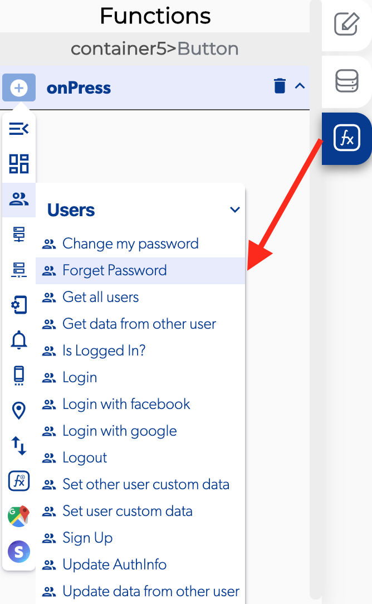

# Forget Password

### 📥 Entry vars 

* **Email:** select a the text field to provide a way for the user to set his email address.

### ↗ Callbacks 

* **Email not sent:** you can set functions after the app can't send the email.
* **Email sent:** you can set functions after the app send the email.

